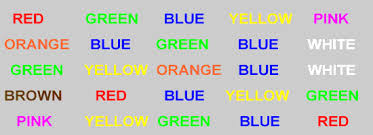
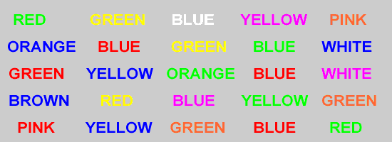

# Machine Learning Foundation Project
## Hypothesis testing on paired samples

### Introduction

Stroop effect is the delay in the response time for a task.

**Congruent test** - Words are in harmony with the colors it suggests, so this test is called the congruent test.

**Incongruent test** - Words are not in harmony with the name of the color which causes the delay in nresponse.

### Files
`Stroop_Effect.ipynb` - Jupyter notebook containing the process. [Click here to view](https://github.com/shreyasdhuliya/Stroop-Effect-Project-Udacity/blob/master/Stroop_Effect.ipynb).

### Data Collection
`stroopdata.csv`
**Paired Samples**  -  both the tests were taken by each candidate which forms a row in the csv.

The data was collected with participation of 24 candidates. Every candidate was asked to read words both set of words, congruent list and inconguent list. Time was recorded both the times.

### Hypothesis to test

`mean(congruent data of population) = mean(Incongruent data of population)`- The Samples of congruent data points belong to the same population that of incongruent data points.

### Test method
T-test - t-distribution of the paired samples does not belong to the critical region 

